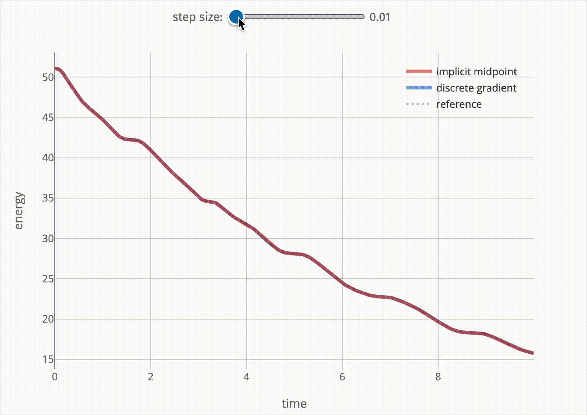

# hi! i'm attila

i'm a postdoc at [tu berlin](tu.berlin). i recently completed my phd in applied mathematics under the supervision of [prof. tobias breiten](https://www.tu.berlin/fgmso/tobias-breiten).

**my research interests include**

- nonlinear energy-based systems (port-hamiltonian, passive, dissipative)
- structured space and time discretization and model reduction (petrov-galerkin, discrete gradient)
- structured optimal control and turnpike properties
- structured feedback control and state estimation

### time discretization

to illustrate the importance of these questions, below the energy of a nonlinear passive system is shown after a time-discrete solution was obtained with 

- the implicit midpoint method (generally *not* structure-preserving for nonlinear systems), and 
- a discrete gradient method suitable for systems dissipative w.r.t. a quadratic supply rate (see [this preprint](https://arxiv.org/abs/2602.15445)).

<figure>

    
    live demo at <a href="https://karsai.xyz#time-discretization" target="_blank">karsai.xyz</a>

</figure>

for the control input $u=0$, the energy should not increase.
nevertheless, we see that for larger choices of the time step size, an increase of the energy is possible for the implicit midpoint method.
the discrete gradient method does not exhibit this behavior.

## projects
if you'd like to take a look at my projects, i recommend checking out 

- [**the repo of my phd thesis**](https://github.com/akarsai/phd)

which combines the code of all of these projects:

- [a structure-preserving modified petrov-galerkin method](https://github.com/akarsai/petrov-galerkin-time-discretization)
- [the extension of that method to differential-algebraic systems](https://github.com/akarsai/structured-discretization-energy-based-models)
- [a structure-preserving discrete gradient scheme for QSR-dissipative systems](https://github.com/akarsai/qsr-discrete-gradients)
- [a passive feedback controller to stabilize nonlinear systems](https://github.com/akarsai/passive-feedback)

to have some fun with your beamer presentations, see [this script](https://github.com/akarsai/beamertheme-rollercoaster) to cycle through beamer themes during the presentation

## contact

<!--  -->